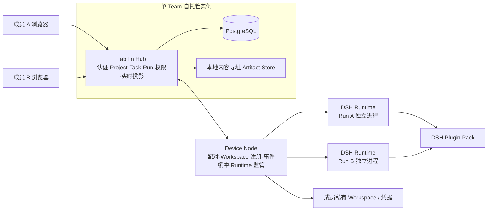

# TabTin 2.0 第一阶段产品与架构设计

> 状态：已确认。上一轮已完成架构讨论，本轮用户明确要求直接写出完整执行方案，因此按已批准设计固化。

## 1. 目标

第一阶段要证明的不是“TabTin 能装多少 App”，而是一个更窄、更承重的命题：

> 两名以上成员可以围绕同一个 Task，让多个长期 Agent 在成员私有 Workspace 中完成独立 Run；成员能观察、评论、批准、取消、重跑并发布 Artifact，同时不会获得不属于自己的本地路径、原始 Session 或工具秘密。

第一阶段成功后，TabTin 2.0 才有资格继续做 Project 群聊、协作文档、市场和更丰富的 App。这个闭环不成立，增加任何工作面都会放大错误模型。

## 2. 三种落地路线

| 路线 | 做法 | 优点 | 代价 | 结论 |
|---|---|---|---|---|
| A. Fork DSH Web | 直接在 DSH Web 上加入 Team、Project、Task 和认证 | 最快看到多人界面；短期继承 UI 插件 | 上游升级长期冲突；团队数据被迫进入 DSH 心智；认证与权限会污染 Runtime | 拒绝 |
| B. TabTin Hub + 现成 DSH SDK | Hub 用当前 stdio JSON-RPC SDK 启动 DSH | 进程隔离简单；原型快 | 当前协议没有单次取消、Session close 和服务端审批请求；无法表达完整团队运行语义 | 只用于早期探针，不作为正式接口 |
| C. TabTin Hub + Device Node + 自有 DSH Bridge | 保持 DSH 不改动，通过一等 Cordis 插件桥接 `ctx.agents`、`session/event` 与审批 seam | 原生吃 DSH Host 插件；团队权威独立；能补齐取消、审批、重连和脱敏 | 第一阶段需要自建一个窄协议和契约测试 | **采用** |

路线 C 不是再造 Runtime。桥接层只翻译生命周期和权限，不实现 Agent Loop、工具注册、模型、Skill、MCP、压缩或 Subagent。

## 3. 产品原则

### 3.1 团队事实与执行事实分开

- Team、Member、Project、Task、Assignment、Agent、Run、Approval、Artifact 由 Hub 权威保存。
- DSH Session、工具调用、模型消息和 Subagent 由 Runtime 权威保存。
- Run 只引用一个 DSH Session；不能把 Session 状态直接当作 Task 状态。
- Runtime 事件必须先投影成产品事件，才能进入 Project 活动流。

### 3.2 Project 不拥有 Workspace

- Workspace 属于 Member 与 Device。
- Hub 只保存 `workspaceId`、显示名、拥有者、Device 和能力摘要。
- 绝对路径只保存在 Node 本地数据库中。
- 发起 Run 时，Task 责任人显式选择自己的 Workspace。
- 其他成员看到“Bob 的发布检查 Workspace”，看不到 `/Users/bob/company/private-repo`。

### 3.3 Agent 是团队角色，执行绑定是个人决定

- Agent 是 Team 共享身份，例如 Builder、Reviewer。
- Agent Profile Revision 保存 persona、模型路由和 Plugin Pack。
- 每个 Run 仍由真人责任人选择 Device、Workspace 与可用凭据。
- DSH Subagent 是一个 Run 内部的临时子执行者，不自动升级为长期 Agent。

### 3.4 插件可组合，产品权威不可漂移

- 插件可以增加模型、Skill、MCP、工具、Hook 和 Subagent provider。
- 插件不能直接写 Team、Task、角色和发布状态。
- 插件通过窄的 Artifact、Approval 与 Run Event 接口影响产品。
- 插件安装、启用、连接凭据、授权给 Agent 是四个不同动作。

### 3.5 生态是上行，不是成立条件

第一阶段用两个内置 Agent、一个 TabTin Bridge 工具和至少一个未经修改的 DSH 插件就必须成立。未来 DSH 插件增长只提高能力密度，不能成为核心用户闭环成立的前提。

## 4. 系统形态



部署只有四个运行角色：

1. **Hub**：一个 Node.js 进程，承担 HTTP、WebSocket、调度和投影。
2. **PostgreSQL**：唯一团队数据存储，同时承载 Outbox。
3. **Web**：由 Hub 静态托管的 React 应用。
4. **Node**：成员设备上的常驻 CLI；每个 Run 再启动一个独立 Runtime 子进程。

Hub 所在机器也可以运行一个 Node，因此不需要单独设计“云 Runtime”。

## 5. 深模块与接口

### 5.1 Team Hub 模块

外部接口只暴露三类动作：

```ts
interface TeamHub {
  command(actor: Actor, command: TeamCommand): Promise<CommandReceipt>
  query(actor: Actor, query: TeamQuery): Promise<TeamView>
  subscribe(actor: Actor, cursor?: EventCursor): AsyncIterable<TeamEvent>
}
```

其实现内部隐藏认证、事务、权限、Outbox、投影、重试和 WebSocket。HTTP 与测试内存驱动只是这个 seam 上的两个 Adapter。

### 5.2 Run Orchestrator 模块

```ts
interface RunOrchestrator {
  start(request: StartRunRequest): Promise<Run>
  cancel(request: CancelRunRequest): Promise<Run>
  decideApproval(request: DecideApprovalRequest): Promise<Approval>
  ingest(frame: NodeEventFrame): Promise<IngestReceipt>
}
```

调用者不接触 Node 连接、DSH Session、重试计时器或事件去重。所有 Run 状态迁移和产品投影集中在这个模块。

### 5.3 Device Gateway 模块

```ts
interface DeviceGateway {
  dispatch(deviceId: DeviceId, command: NodeCommand): Promise<DispatchReceipt>
  connected(deviceId: DeviceId): boolean
  subscribe(): AsyncIterable<NodeEventFrame>
}
```

生产 Adapter 使用 WebSocket + PostgreSQL Outbox；测试 Adapter 使用内存队列。Node 的断线、重连、ack 和租约语义不泄漏给业务调用者。

### 5.4 Runtime Driver 模块

```ts
interface RuntimeDriver {
  start(spec: RuntimeStartSpec): Promise<RuntimeHandle>
}

interface RuntimeHandle {
  readonly runId: RunId
  events(): AsyncIterable<RuntimeEvent>
  followup(input: RuntimeInput): Promise<void>
  cancel(cause: 'user' | 'parent'): Promise<void>
  decide(decision: RuntimeApprovalDecision): Promise<void>
  dispose(): Promise<void>
}
```

第一阶段只有 DSH Adapter 和 Fake Adapter，因此这个 seam 是真实的；Node Supervisor 与 E2E 均通过同一接口工作。

### 5.5 Artifact Store 模块

```ts
interface ArtifactStore {
  stage(input: StageArtifactInput): Promise<ArtifactCandidate>
  publish(input: PublishArtifactInput): Promise<Artifact>
  open(actor: Actor, artifactId: ArtifactId): Promise<ReadableStream>
}
```

第一阶段使用本地内容寻址文件系统 Adapter，测试使用内存 Adapter。未来切换 S3 不改变 Task Room。

## 6. 核心用户流程

### 6.1 建立团队

1. 管理员启动 Compose。
2. 首次访问输入实例生成的一次性 Setup Token，创建 Owner。
3. Owner 创建邀请；第二名成员设置用户名和密码。
4. Owner 创建 Builder 与 Reviewer 两个 Agent。

### 6.2 配对执行现场

1. 成员在 Web 端生成十分钟有效的配对码。
2. 本机执行 `tabtin-node pair <server> <code>`。
3. Node 获得不可逆哈希存储的长期 Device Token。
4. 成员执行 `tabtin-node workspace add --name project-alpha --path <absolute-path>`。
5. Node 本地保存绝对路径；Hub 只收到不透明 Workspace 身份和能力摘要。

### 6.3 Task 到 Run

1. 成员创建 Task 并指定一名真人责任人。
2. 责任人接受 Assignment，选择 Agent、Workspace 和 Runtime Profile。
3. Hub 在同一事务内创建 `Run(queued)` 与 Outbox 命令。
4. Node ack 后，Run 进入 `dispatching`；Runtime ready 后进入 `running`。
5. Node 将 DSH 事件分成 owner-only 和 project 两种投影发送给 Hub。

### 6.4 审批

1. DSH 工具策略返回 `ask`。
2. Bridge 用 `callId` 关联 `tool/call`，在 Node 侧去除密钥、绝对路径和超长参数。
3. Hub 创建十分钟有效的 `Approval(pending)`。
4. 只有 Workspace 拥有人能允许或拒绝；Owner/Admin 只能紧急取消 Run。
5. 决定回传 DSH 的一次性审批 seam；不产生“永久允许”。

### 6.5 Artifact 与第二个 Agent

1. Agent 调用 TabTin Bridge 注册的 `publish_artifact` 工具，参数只能是 Workspace 内相对路径。
2. Node 验证真实路径仍在根目录内，计算 SHA-256 并上传候选文件。
3. 责任人在 Task Room 检查候选并发布。
4. Reviewer Run 只能读取已发布 Artifact 的下载副本，不能自动继承 Builder 的 Workspace。
5. Reviewer 结果作为脱敏 Run 最终摘要或新的 Artifact 回到同一 Task；Comment 仍是真人协作消息。
6. Task 责任人检查交付与复核结果，再人工提交验收并标记完成；Agent 不能自动关闭 Task。

## 7. 数据与事件原则

### 7.1 两套日志，两个目的

- DSH Session Log：完整、Runtime 私有、用于模型上下文、恢复和本机取证。
- Team Event Log：产品语义、脱敏、保存在 PostgreSQL，用于 Task Room、审计和重连。

Hub 不持久化每个 token delta。直播 delta 只走 WebSocket；提交后的 assistant message、状态、工具结果摘要、Approval 和 Artifact 才进入团队事件表。

### 7.2 幂等与顺序

- 每个 Node command 有 `commandId`。
- 每个 Run event 有从 1 开始的单调 `seq`。
- Hub 对 `(runId, seq)` 建唯一约束。
- Node 在收到 Hub ack 前将事件保存在本地 spool。
- Hub 重启后，Node 从最后 ack 的序号继续发送。

### 7.3 不做假恢复

- Hub 重启：Node 重连并补发，可恢复。
- Node 短断线：租约内等待重连，可恢复。
- Runtime 进程退出：Run 标记 `failed(runtime_lost)`，不自动重放可能产生副作用的工具。
- 用户重跑：创建新 Run，并记录 `rerunOfRunId`。

## 8. 认证、角色与可见性

角色只有 `owner | admin | member`。

| 动作 | Owner | Admin | Member |
|---|---:|---:|---:|
| 邀请与停用成员 | 是 | 是 | 否 |
| 安装 Plugin Package | 是 | 是 | 否 |
| 创建 Project、Task、评论 | 是 | 是 | 是 |
| 创建或修改 Agent | 是 | 是 | 否 |
| 启动自己的 Task Run | 是 | 是 | 是 |
| 批准自己的 Workspace 动作 | 是 | 是 | 是 |
| 批准他人 Workspace 动作 | 否 | 否 | 否 |
| 紧急取消任意 Run | 是 | 是 | 否 |
| 查看他人原始 Session/路径 | 否 | 否 | 否 |

认证采用本地用户名 + Argon2id 密码、随机 Session Token 和 HttpOnly Cookie。所有非安全方法必须校验同源 Origin；WebSocket 必须校验 Origin 和 Session。Device 使用独立、可撤销、数据库只存哈希的 Token。

## 9. 插件策略

第一阶段的插件状态分为：

- `builtin`：TabTin Bridge 和经过完整测试的基础 DSH 包。
- `curated`：锁定精确版本、完整性摘要和能力声明的第三方包。
- `unreviewed`：只允许管理员在隔离测试 Runtime 中通过 CLI 探测，不能进入普通 Agent Profile。

普通 DSH 插件不需要修改自身包才能接入；TabTin curated catalog 可以在 tarball 之外附加审核与 capability overlay。既没有自声明也没有 curated overlay 的包默认视为 `legacy_unrestricted`。这不是“恶意”判断，而是承认 npm 代码可以在 Runtime 权限内执行任意初始化逻辑。

第一阶段只实现团队级 Install 与 Agent Profile 中的 Enable；模型凭据保存在 Node，Approval 仍是 Run 级一次性决定。公开市场、评分、自动更新和付费不在范围内。

## 10. 技术基线

- Node.js 24.x，pnpm 11.7.x，TypeScript 6.x。
- Hub：Fastify 5.12.x、`@fastify/websocket` 11.3.x、Zod 4.4.x。
- 数据：PostgreSQL 18.x、Drizzle ORM 0.45.x、postgres.js 3.4.x。
- Web：React 19.2.x、React Router 8.3.x、TanStack Query 5.101.x、Vite 8.2.x。
- 测试：Vitest 4.1.x、Playwright 1.62.x。
- 密码：`@node-rs/argon2` 2.1.x。
- DSH 发行基线：`@deepseek-ai/dsh@0.1.0-rc.6`；所有直接使用的 DSH 包由仓库 catalog 与 lockfile 精确固定。

DSH 仍是预览版。业务代码不得依赖 DSH 内部源码路径；只通过公开包导出和 `@tabtin/runtime-dsh` Adapter 使用。

### 10.1 为什么是 TypeScript + Fastify，而不是换一个更重的后端框架

第一阶段的性能目标是 3–10 人、2 个并发 Run，主要风险是状态、协议和权限分叉，不是 HTTP 框架吞吐上限。Django 旧实现的 ORM、Admin、Celery 和 API 契约不进新仓库；这不是对 Django 做抽象性性能判决，而是新产品已无任何兼容或运维理由继续携带它。

Go/Rust 可以获得更低的单请求开销，但会让 Hub、Web、Node、Runtime 之间的 Zod 协议、事件和错误码出现第二份语义，也会拉长 DSH 预览期的 Adapter 迭代链。Fastify 提供足够窄的 HTTP/WS 边界、schema 校验与无网络 `inject` 测试；真实上限由 Q8 性能门决定。若 Q8 失败，先用 profile 找到单一深模块，而不先拆微服务或重写语言。

## 11. 失败处理

| 故障 | 产品行为 | 机器证据 |
|---|---|---|
| Device 离线 | 启动前阻止 Run；已运行 Run 显示“设备连接未知” | `device.lease_expired` |
| Workspace 被删除 | Node preflight 失败，不启动 Runtime | `run.failed/workspace_unavailable` |
| Profile 或插件不匹配 | Node 拒绝命令并返回当前 digest | `run.failed/profile_mismatch` |
| DSH 无法启动 | Run 失败，保留 stderr 尾部的脱敏摘要 | `run.failed/runtime_start_failed` |
| 审批无人处理 | 十分钟后拒绝并使工具失败，Run 可继续决定下一步 | `approval.expired` |
| Hub 重启 | Node 重连补发，浏览器按 cursor 续订 | `(runId, seq)` 无缺口 |
| Runtime 崩溃 | 不透明恢复；Run 失败，用户显式重跑 | `run.failed/runtime_lost` |
| Artifact 越界或哈希不符 | 拒绝候选，不发布任何路径信息 | `artifact.rejected` |

## 12. 测试设计

测试通过模块接口而非内部方法：

- `packages/domain`：纯状态机与权限表单元测试。
- `TeamHub`：Fastify `inject` Adapter 与真实 PostgreSQL 集成测试。
- `DeviceGateway`：内存 Adapter 测调度，WebSocket Adapter 测重连与去重。
- `RuntimeDriver`：Fake Adapter 测 Orchestrator；DSH Adapter 用 `dsh-llm-replay` 无密钥测试。
- 浏览器：Playwright 两个独立 Context，不能共享 Cookie。
- 全链：两个用户 + 一个 Node + 两个 Runtime + 一个 Approval + 两个 Artifact。

每条关键链路都必须具备：驱动、观测、判定、归因、取证和发现。E2E 失败输出一个 `evidence/<run-id>/` 包，包含 API 调用、Team 事件、Node 事件、Runtime stderr 摘要和截图索引，但不包含密码、Token、绝对路径或完整私有正文。

## 13. 第一阶段成功门

必须同时满足：

1. 新机器已有 Docker 的前提下，15 分钟内完成 Hub 启动、Owner 创建和第二成员邀请。
2. 两个浏览器用户完成标准流程，自动 E2E 连续运行 20 次无偶发失败。
3. 两个并发 Run 的事件、Approval 和 Artifact 不串线。
4. 非责任人成员无法通过 HTTP、WebSocket、猜测 ID 或数据库投影获得原始 Session、绝对路径和未发布 Artifact。
5. Hub 重启和一次 Node 短断线后，Run 事件无重复、无缺口。
6. Runtime 崩溃不会自动重放高风险工具；重跑创建新 Run。
7. 至少一个未修改的 DSH Tool/Skill 插件在 curated Profile 中工作。
8. 所有依赖于 DSH 的契约探针在升级前后保持全绿。
9. 10 个并发浏览器连接、2 个并发 Run 时，Hub 非流式接口本机网络 p95 小于 250ms，产品事件传播 p95 小于 500ms。
10. `pnpm check`、集成测试、E2E、依赖审计和容器 smoke 全绿。

## 14. 明确非目标

- 多 Team、多租户、云计费和企业 SSO。
- Project 私有权限、外部访客与复杂角色自定义。
- 同一个 DSH Session 内的多个长期 Agent 共同发言。
- Project 群聊、邮件、日历、TabData、TabDoc、白板和浏览器工作面。
- DSH 前端插件无修改接入。
- 插件公开市场、自动更新、评分、付费和远程审核。
- Runtime 崩溃后的透明续跑或外部副作用 exactly-once 保证。
- Electron、iOS、Android 与桌面设备控制。
- 面向人类协作的完整 `tabtin` CLI；第一阶段保证所有产品动作都有稳定 HTTP/WS 契约，但只交付 Hub/Node 运维 CLI。
- 任意互联网直接暴露 Device Node；Node 只建立出站连接。
