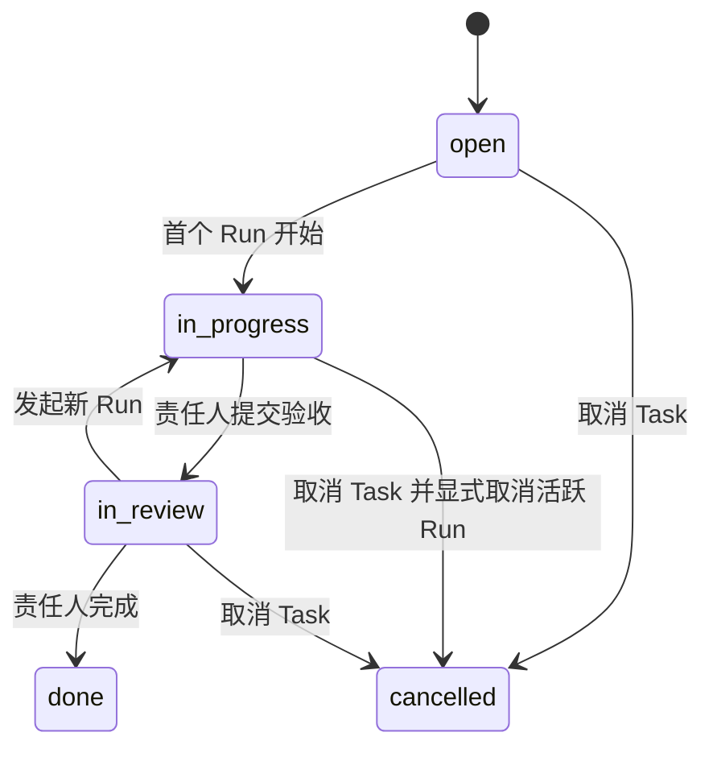
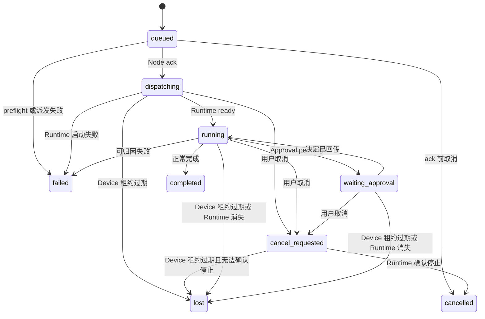
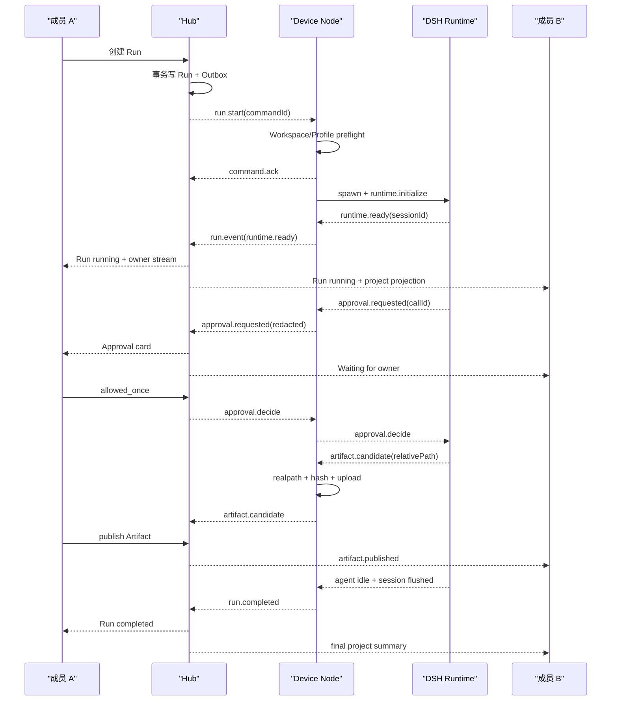

# 第一阶段领域模型与运行协议

> 本文是第一阶段数据字段、状态迁移、权限与 Hub↔Node↔Runtime wire 的单一事实源。代码中的 Zod schema、数据库约束和协议 fixture 必须逐项对应本文。

## 1. 全局约定

- 所有持久 ID 使用 UUIDv7 字符串；测试 fixture 使用合法但固定的 UUIDv7。
- 时间使用 UTC ISO 8601，数据库使用 `timestamptz`。
- 外部 JSON 字段使用 `camelCase`，PostgreSQL 字段使用 `snake_case`。
- 所有写命令携带 `idempotencyKey`；同一 actor、route 和 key 返回第一次结果。
- 所有协议 envelope 固定 `protocolVersion: 1`。
- wire 上的自由值字段使用 `Json`（任意合法 JSON 值；实现为 zod `z.json()`）。`unknown` 仅保留给 `session.event` 的 DSH SessionEvent 原样透传。
- 金额、计费和 Token 配额不进入第一阶段模型。
- 一个部署只允许一条 `team` 记录；第二条插入由数据库约束拒绝。

## 2. 实体与不变量

### 2.1 Team 与身份

#### `team`

| 字段 | 类型 | 规则 |
|---|---|---|
| `id` | uuid | 主键 |
| `name` | varchar(80) | 去首尾空格后 1–80 字符 |
| `created_at` | timestamptz | 不可变 |

#### `user_account`

| 字段 | 类型 | 规则 |
|---|---|---|
| `id` | uuid | 主键 |
| `username` | varchar(32) | 小写，正则 `^[a-z0-9][a-z0-9._-]{2,31}$`，唯一 |
| `display_name` | varchar(80) | 1–80 字符 |
| `password_hash` | text | Argon2id PHC 字符串 |
| `disabled_at` | timestamptz nullable | 被停用后所有 Session 与 Device Token 失效 |
| `created_at` | timestamptz | 不可变 |

#### `team_member`

| 字段 | 类型 | 规则 |
|---|---|---|
| `team_id` | uuid | 唯一 Team |
| `user_id` | uuid | 每个用户一条 |
| `role` | enum | `owner | admin | member` |
| `joined_at` | timestamptz | 不可变 |

不变量：始终至少有一个未停用 Owner；最后一个 Owner 不能降级或停用。

#### `auth_session`

| 字段 | 类型 | 规则 |
|---|---|---|
| `id` | uuid | Cookie 中使用随机 opaque token，不直接暴露此 ID |
| `user_id` | uuid | 所属用户 |
| `token_hash` | bytea | SHA-256，唯一 |
| `expires_at` | timestamptz | 默认 30 天 |
| `last_seen_at` | timestamptz | 每 5 分钟最多更新一次 |
| `revoked_at` | timestamptz nullable | 登出或成员停用时写入 |

#### `invite`

| 字段 | 类型 | 规则 |
|---|---|---|
| `id` | uuid | 主键 |
| `token_hash` | bytea | 一次性随机 Token 的 SHA-256，唯一 |
| `role` | enum | `admin | member`；不能邀请 Owner |
| `created_by` | uuid | Owner/Admin |
| `expires_at` | timestamptz | 默认 72 小时 |
| `consumed_by` | uuid nullable | 成功注册后写入 |
| `consumed_at` | timestamptz nullable | 与 `consumed_by` 同时出现 |

### 2.2 Project 与 Task

#### `project`

| 字段 | 类型 | 规则 |
|---|---|---|
| `id` | uuid | 主键 |
| `name` | varchar(120) | Team 内唯一，1–120 字符 |
| `description` | text | 最大 4000 字符 |
| `created_by` | uuid | Member |
| `archived_at` | timestamptz nullable | 归档后不可新建 Task 或 Run |
| `created_at` / `updated_at` | timestamptz | 更新时间由数据库写入 |

第一阶段所有未停用成员都可访问所有 Project。

#### `task`

| 字段 | 类型 | 规则 |
|---|---|---|
| `id` | uuid | 主键 |
| `project_id` | uuid | 所属 Project |
| `title` | varchar(200) | 1–200 字符 |
| `description` | text | 最大 20000 字符 |
| `status` | enum | `open | in_progress | in_review | done | cancelled` |
| `assignee_user_id` | uuid | 必须是未停用 Member |
| `assignment_status` | enum | `pending | accepted | rejected` |
| `created_by` | uuid | Member |
| `accepted_at` | timestamptz nullable | 仅 accepted 有值 |
| `completed_at` | timestamptz nullable | 仅 done 有值 |
| `created_at` / `updated_at` | timestamptz | 不可由客户端指定 |

不变量：

- Task 始终有一名真人 assignee；Agent 不能成为 assignee。
- assignee 变化后 `assignment_status` 重置为 `pending`。
- `assignment_status != accepted` 时不能创建 Run。
- 存在非终态 Run 时不能换 assignee。
- `done` 与 `cancelled` 不能创建 Run；重开 Task 是显式命令。
- Run 终态不会隐式把 Task 改成 done；责任人必须进入 `in_review` 后显式完成。

#### `task_comment`

| 字段 | 类型 | 规则 |
|---|---|---|
| `id` | uuid | 主键 |
| `task_id` | uuid | 所属 Task |
| `author_user_id` | uuid | Member |
| `body` | text | 1–10000 字符 |
| `created_at` | timestamptz | 不可变 |
| `edited_at` | timestamptz nullable | 第一阶段允许作者编辑 |

### 2.3 Agent 与 Profile

#### `agent`

| 字段 | 类型 | 规则 |
|---|---|---|
| `id` | uuid | 主键 |
| `name` | varchar(80) | Team 内唯一 |
| `description` | varchar(500) | 团队成员可见 |
| `current_revision_id` | uuid | 指向不可变 Profile Revision |
| `created_by` | uuid | Owner/Admin |
| `archived_at` | timestamptz nullable | 归档后不能新建 Run |

#### `agent_profile_revision`

| 字段 | 类型 | 规则 |
|---|---|---|
| `id` | uuid | 主键，不可更新 |
| `agent_id` | uuid | 所属 Agent |
| `revision` | integer | 每个 Agent 从 1 单调递增 |
| `persona` | text | 1–20000 字符 |
| `provider` | varchar(100) | DSH provider route |
| `model` | varchar(200) | DSH model id |
| `credential_slot` | varchar(80) | 只是成员 Node 上的 secret 别名，不是凭据 |
| `max_tokens` | integer nullable | 正整数；空值交给 adapter |
| `plugin_pack_id` | uuid | 不可变 Plugin Pack |
| `profile_digest` | char(64) | 规范化 JSON 的 SHA-256 |
| `created_by` | uuid | Owner/Admin |
| `created_at` | timestamptz | 不可变 |

Agent 编辑始终创建新 Revision，不修改已运行 Run 的快照。

### 2.4 Device 与 Workspace

#### `device`

| 字段 | 类型 | 规则 |
|---|---|---|
| `id` | uuid | 主键 |
| `owner_user_id` | uuid | 永不转移 |
| `name` | varchar(80) | 拥有人范围内唯一 |
| `platform` | enum | `darwin | linux | win32` |
| `architecture` | varchar(32) | Node `process.arch` |
| `node_version` | varchar(32) | Node 版本 |
| `node_app_version` | varchar(32) | TabTin Node 版本 |
| `token_hash` | bytea | Device Token 的 SHA-256 |
| `capabilities` | jsonb | 只含布尔能力与版本，不含路径/凭据 |
| `last_seen_at` | timestamptz nullable | heartbeat 更新 |
| `revoked_at` | timestamptz nullable | 撤销后断线且无法重连 |

#### `device_pairing_code`

| 字段 | 类型 | 规则 |
|---|---|---|
| `id` | uuid | 主键 |
| `owner_user_id` | uuid | 只能为自己配对 |
| `code_hash` | bytea | 六组 base32 配对码的 SHA-256 |
| `expires_at` | timestamptz | 10 分钟 |
| `consumed_at` | timestamptz nullable | 一次性 |

#### `workspace`

Hub 记录：

| 字段 | 类型 | 规则 |
|---|---|---|
| `id` | uuid | 由 Node 生成 |
| `device_id` | uuid | 所属 Device |
| `owner_user_id` | uuid | 必须等于 Device owner |
| `name` | varchar(80) | 拥有人范围内唯一 |
| `kind` | enum | `directory | git_repository` |
| `capabilities` | jsonb | `read`, `write`, `git` 等布尔值 |
| `available` | boolean | Node preflight 投影 |
| `last_checked_at` | timestamptz | Node 报告 |

Node 本地 `workspace_registry` 额外保存：

| 字段 | 类型 | 规则 |
|---|---|---|
| `workspace_id` | text | 与 Hub 一致 |
| `canonical_path` | text | `realpath` 后绝对路径，永不发给 Hub |
| `path_fingerprint` | text | HMAC-SHA-256，用于检测路径变化，不发给其他成员 |
| `created_at` | text | 本地时间 |

### 2.5 Plugin

#### `plugin_installation`

| 字段 | 类型 | 规则 |
|---|---|---|
| `id` | uuid | 主键 |
| `package_name` | varchar(214) | 合法 npm package name |
| `package_version` | varchar(64) | 精确版本，不允许 range/tag |
| `integrity` | text | npm SRI 值 |
| `dependency_lock_digest` | char(64) | 受审全依赖闭包 lockfile 的 SHA-256 |
| `trust` | enum | `builtin | curated | unreviewed` |
| `capability_class` | enum | `declared | legacy_unrestricted` |
| `capabilities` | jsonb | 文件、网络、子进程、凭据声明 |
| `status` | enum | `installed | disabled | failed` |
| `installed_by` | uuid | Owner/Admin |
| `created_at` | timestamptz | 不可变 |

#### `plugin_pack`

| 字段 | 类型 | 规则 |
|---|---|---|
| `id` | uuid | 主键，不可变 |
| `name` | varchar(80) | Team 内唯一 |
| `installations` | jsonb | 按 package name 排序的 installation id 数组 |
| `pack_digest` | char(64) | 规范化内容 SHA-256 |
| `created_by` | uuid | Owner/Admin |
| `created_at` | timestamptz | 不可变 |

`unreviewed` 不能进入普通 Plugin Pack；只能由 CLI 启动一次性探测 Runtime。

### 2.6 Run、Approval 与 Artifact

#### `run`

| 字段 | 类型 | 规则 |
|---|---|---|
| `id` | uuid | 主键 |
| `task_id` | uuid | 所属 Task |
| `owner_user_id` | uuid | 创建时等于 Task assignee，固化 |
| `agent_id` | uuid | 固化 Agent |
| `profile_revision_id` | uuid | 固化 Revision |
| `device_id` | uuid | 必须属于 owner |
| `workspace_id` | uuid | 必须属于 device 与 owner |
| `dsh_session_id` | varchar(128) nullable | Runtime ready 后写入 |
| `status` | enum | 见状态机 |
| `failure_code` | varchar(64) nullable | 仅 failed/lost |
| `failure_summary` | varchar(1000) nullable | 已脱敏 |
| `rerun_of_run_id` | uuid nullable | 同 Task 的终态 Run |
| `profile_digest` | char(64) | 与 Revision 一致 |
| `plugin_pack_digest` | char(64) | 与 Pack 一致 |
| `dsh_distribution_version` | varchar(64) | 例如 `0.1.0-rc.6` |
| `created_at` / `started_at` / `finished_at` | timestamptz | 按状态写入 |

#### `run_event`

| 字段 | 类型 | 规则 |
|---|---|---|
| `id` | uuid | 主键 |
| `run_id` | uuid | 所属 Run |
| `seq` | bigint | 从 1 单调增加；`(run_id, seq)` 唯一 |
| `type` | varchar(80) | 产品事件类型 |
| `audience` | enum | `owner | project | admin` |
| `payload` | jsonb | 已过对应 Zod schema 与脱敏策略 |
| `occurred_at` | timestamptz | Node/Runtime 发生时间 |
| `received_at` | timestamptz | Hub 接收时间 |

直播 `assistant.delta` 不写 `run_event`，只在 owner WebSocket 在线时转发。

#### `approval`

| 字段 | 类型 | 规则 |
|---|---|---|
| `id` | uuid | 主键 |
| `run_id` | uuid | 所属 Run |
| `call_id` | varchar(128) | `(run_id, call_id)` 唯一 |
| `tool_name` | varchar(200) | DSH 工具名 |
| `reason` | varchar(1000) | 脱敏 |
| `preview` | jsonb | 经过工具级 allowlist 的参数摘要 |
| `status` | enum | `pending | allowed_once | rejected | expired | cancelled` |
| `requested_at` / `expires_at` | timestamptz | 默认 10 分钟 |
| `decided_by` | uuid nullable | 必须等于 Run owner |
| `decided_at` | timestamptz nullable | 终态写入 |

#### `artifact`

| 字段 | 类型 | 规则 |
|---|---|---|
| `id` | uuid | 主键 |
| `task_id` / `run_id` | uuid | 来源 |
| `owner_user_id` | uuid | Run owner |
| `title` | varchar(200) | 1–200 字符 |
| `media_type` | varchar(200) | IANA media type |
| `byte_size` | bigint | 0–52,428,800 |
| `sha256` | char(64) | 内容摘要 |
| `storage_key` | text | `sha256/ab/cd/<digest>`，不暴露本地源路径 |
| `source_relative_path` | text nullable | 仅 owner 可见，已规范化 |
| `status` | enum | `candidate | published | rejected` |
| `created_at` / `published_at` | timestamptz | 状态对应 |

同一 SHA-256 内容只存一份 blob；Artifact 元数据可多条。

#### `dispatch_outbox`

| 字段 | 类型 | 规则 |
|---|---|---|
| `id` | uuid | `commandId` |
| `device_id` | uuid | 目标 Device |
| `type` | varchar(80) | Node command 类型 |
| `payload` | jsonb | 协议校验通过 |
| `attempt_count` | integer | 从 0 开始 |
| `next_attempt_at` | timestamptz | 指数退避，上限 30 秒 |
| `acked_at` | timestamptz nullable | Node ack 后写入 |
| `failed_at` | timestamptz nullable | 不可恢复时写入 |

## 3. 状态机

### 3.1 Task



Assignment 是正交状态：

```text
pending -> accepted
pending -> rejected
rejected -> pending   （重新指派）
accepted -> pending   （无活跃 Run 时重新指派）
```

### 3.2 Run



终态：`completed | failed | cancelled | lost`。终态之间禁止迁移。

特殊规则：

- `waiting_approval` 只表示存在至少一条 pending Approval；最后一条结束后回到 `running`。
- Node 断线先写连接投影，不立即改变 Run；30 秒租约过期后进入 `lost`。
- `cancel_requested` 15 秒未确认时 Node Supervisor 终止 Runtime，写 `cancelled(forced)`。
- `completed` 必须在 Runtime idle、Session flush 和最后事件 ack 后产生。

### 3.3 Approval

```text
pending -> allowed_once
pending -> rejected
pending -> expired
pending -> cancelled
```

只有第一条有效决定获胜。重复相同决定返回第一次结果；冲突决定返回 `APPROVAL_ALREADY_DECIDED`。

### 3.4 Artifact

```text
candidate -> published
candidate -> rejected
```

Artifact 发布不会自动完成 Task；它只产生 `artifact.published` Team Event。

## 4. HTTP 接口

所有接口前缀 `/api/v1`，响应 envelope：

```ts
type ApiSuccess<T> = { ok: true; data: T }
type ApiFailure = {
  ok: false
  error: { code: ErrorCode; message: string; requestId: string; details?: Json }
}
```

核心路由：

| 方法 | 路径 | 权限 | 结果 |
|---|---|---|---|
| GET | `/setup/status` | 匿名 | 只返回 `initialized: boolean` |
| POST | `/setup` | 未初始化实例 + Setup Token | 创建 Team 与 Owner |
| GET | `/team` | Member | 当前单 Team 基本信息 |
| POST | `/auth/login` | 匿名 | 建立 Session Cookie |
| POST | `/auth/logout` | 登录 | 撤销当前 Session |
| GET | `/auth/session` | 登录 | 当前 Member |
| POST | `/invites` | Owner/Admin | 创建邀请 |
| POST | `/invites/accept` | 匿名 + Token | 创建 Member |
| GET/POST | `/projects` | Member | 列表 / 创建 |
| GET | `/projects/:projectId` | Member | Project 概览 |
| POST | `/projects/:projectId/tasks` | Member | 创建 Task |
| GET/PATCH | `/tasks/:taskId` | Member | 详情 / 修改非状态字段 |
| POST | `/tasks/:taskId/accept` | assignee | 接受 Assignment |
| POST | `/tasks/:taskId/reject` | assignee | 拒绝 Assignment |
| POST | `/tasks/:taskId/submit-review` | accepted assignee | 无活跃 Run 且已有发布 Artifact 时进入验收 |
| POST | `/tasks/:taskId/complete` | accepted assignee | 人工将 in_review Task 标记 done |
| POST | `/tasks/:taskId/cancel` | accepted assignee | 取消 Task，有活跃 Run 时同步请求取消 |
| POST | `/tasks/:taskId/comments` | Member | 添加 Comment |
| POST | `/tasks/:taskId/runs` | accepted assignee | 创建 Run |
| GET | `/runs/:runId` | Member | 脱敏 Run 投影；owner 可多见诊断摘要 |
| POST | `/runs/:runId/cancel` | Run owner 或 Owner/Admin | 请求取消 |
| POST | `/approvals/:approvalId/decisions` | Run owner | 一次性决定 |
| POST | `/artifacts/:artifactId/publish` | Run owner | 发布候选 |
| GET | `/artifacts/:artifactId/content` | owner 或 published project member | 下载内容 |
| GET/POST | `/agents` | GET Member；POST Owner/Admin | 列表 / 创建 |
| POST | `/agents/:agentId/revisions` | Owner/Admin | 新建 Revision |
| POST | `/devices/pairing-codes` | Member | 创建配对码 |
| GET | `/devices` | 当前 Member | 自己的 Device |
| DELETE | `/devices/:deviceId` | Device owner 或 Owner/Admin | 撤销 Token 并断开 Device |
| GET | `/workspaces` | 当前 Member | 自己的不透明 Workspace 投影 |
| POST | `/devices/pairing-claims` | 匿名 + 未过期配对码 | Node 用 code 换取只返回一次的长期 Device Token |
| POST | `/node/runs/:runId/artifacts` | 该 Run 的 Device Token | 流式上传 Artifact candidate |
| GET | `/node/plugin-packs/:packDigest` | Device Token | 获取不含 secret 的不可变 pack/lock descriptor |
| GET | `/plugins/catalog` | Member | 查看 curated catalog 和审核摘要 |
| GET/POST | `/plugins/installations` | GET Member；POST Owner/Admin | 列表 / 供给精确 curated 包 |
| GET/POST | `/plugin-packs` | GET Member；POST Owner/Admin | 列表 / 创建不可变 Pack |

所有来自 Browser 的 POST/PATCH/DELETE（包括匿名 Setup 和 Invite accept）都要求 `Origin` 精确等于 `TABTIN_PUBLIC_ORIGIN`、`Idempotency-Key` 为 16–128 字符，且 JSON body 经 Zod 严格模式解析；是否要求 Cookie 以上表的权限列为准。

Node 专用路由不接受 Browser Cookie：`/devices/pairing-claims` 使用未过期配对码，`/node/**` 使用 Device Token；两者都要求 Idempotency-Key 和严格 metadata schema，但不用 Browser Origin 作身份证明。

## 5. Browser WebSocket

路径：`GET /ws/v1/client?cursor=<event-id>`。

连接条件：有效 Session Cookie、同源 Origin。服务端只下行事件，客户端命令继续走 HTTP。

```ts
type ClientFrame =
  | {
      protocolVersion: 1
      kind: 'persistent'
      cursor: string
      occurredAt: string
      event: {
        type:
          | 'project.changed'
          | 'task.changed'
          | 'comment.created'
          | 'run.changed'
          | 'run.event'
          | 'approval.changed'
          | 'artifact.changed'
          | 'device.changed'
        payload: Json
      }
    }
  | {
      protocolVersion: 1
      kind: 'live'
      runId: string
      audience: 'owner'
      deltaSeq: number
      delta: { text: string }
    }
  | {
      protocolVersion: 1
      kind: 'control'
      type: 'resync.required'
      latestCursor: string
    }
```

规则：

- 重连 cursor 在 24 小时保留窗口内时补发持久 Team Event。
- cursor 过旧返回 `resync.required`，客户端重新查询页面数据。
- owner-only Run Event 只发给 `run.ownerUserId`。
- project Run Event 发给所有 Member。
- `assistant.delta` 是不持久的 owner-only 帧，不占 Team Event cursor。

## 6. Hub ↔ Device Node 协议

路径：`GET /ws/v1/node`。Node 使用 `Authorization: Device <opaque-token>`，不使用浏览器 Cookie。

### 6.1 Envelope

```ts
type WireEnvelope<TType extends string, TPayload> = {
  protocolVersion: 1
  messageId: string
  type: TType
  sentAt: string
  payload: TPayload
}
```

### 6.2 Node 上行

```ts
type NodeUpstream =
  | WireEnvelope<'node.hello', {
      deviceId: string
      nodeVersion: string
      platform: 'darwin' | 'linux' | 'win32'
      architecture: string
      supportedProtocolVersions: [1]
      dshDistributionVersion: string
      pluginPackDigests: string[]
    }>
  | WireEnvelope<'node.heartbeat', {
      deviceId: string
      activeRunIds: string[]
      lastEventSeqByRun: Record<string, number>
    }>
  | WireEnvelope<'node.inventory', {
      deviceId: string
      credentialSlots: Array<{ provider: string; slot: string }>
      workspaces: Array<{
        workspaceId: string
        name: string
        kind: 'directory' | 'git_repository'
        capabilities: { read: boolean; write: boolean; git: boolean }
        available: boolean
        lastCheckedAt: string
      }>
    }>
  | WireEnvelope<'command.ack', {
      commandId: string
      accepted: boolean
      error?: WireError
    }>
  | WireEnvelope<'run.snapshot', RunSnapshot>
  | WireEnvelope<'run.event', ProjectedRunEvent>
  | WireEnvelope<'run.live_delta', {
      runId: string
      deltaSeq: number
      text: string
    }>
```

### 6.3 Hub 下行

```ts
type NodeDownstream =
  | WireEnvelope<'run.start', {
      commandId: string
      runId: string
      taskId: string
      ownerUserId: string
      agent: {
        id: string
        profileRevisionId: string
        persona: string
        provider: string
        model: string
        credentialSlot: string
        maxTokens?: number
      }
      workspaceId: string
      expectedProfileDigest: string
      expectedPluginPackDigest: string
      prompt: string
    }>
  | WireEnvelope<'run.cancel', {
      commandId: string
      runId: string
      cause: 'user' | 'admin'
    }>
  | WireEnvelope<'run.status_request', {
      commandId: string
      runId: string
    }>
  | WireEnvelope<'run.event_ack', {
      runId: string
      throughSeq: number
    }>
  | WireEnvelope<'run.resend_from', {
      runId: string
      fromSeq: number
    }>
  | WireEnvelope<'approval.decide', {
      commandId: string
      runId: string
      approvalId: string
      callId: string
      decision: 'allowed_once' | 'rejected'
    }>
  | WireEnvelope<'node.token_revoked', { reason: string }>
```

### 6.4 Projected Run Event

```ts
type ProjectedRunEvent = {
  runId: string
  seq: number
  occurredAt: string
  audience: 'owner' | 'project' | 'admin'
  event:
    | { type: 'runtime.ready'; dshSessionId: string }
    | { type: 'run.phase'; phase: 'thinking' | 'tool' | 'finalizing' }
    | { type: 'assistant.message'; text: string }
    | { type: 'tool.started'; callId: string; toolName: string; preview: Json }
    | { type: 'tool.finished'; callId: string; outcome: 'succeeded' | 'failed' | 'cancelled' }
    | { type: 'approval.requested'; approval: ApprovalWire }
    | { type: 'approval.decided'; approvalId: string; status: string }
    | { type: 'artifact.candidate'; artifact: ArtifactWire }
    | { type: 'subagent.started'; childSessionId: string; label?: string }
    | { type: 'subagent.finished'; childSessionId: string; outcome: string }
    | { type: 'run.completed'; finalText: string }
    | { type: 'run.failed'; code: ErrorCode; summary: string }
    | { type: 'run.cancelled'; forced: boolean }
}
```

## 7. Node ↔ DSH Runtime 协议

Runtime 子进程的 stdout 只能写 NDJSON 协议；日志只能写 stderr。Node 通过 stdin 发送命令。

### 7.1 Node 命令

```ts
type RuntimeCommand =
  | WireEnvelope<'runtime.initialize', {
      runId: string
      workspacePath: string
      dshHomePath: string
      profileDigest: string
      pluginPackDigest: string
      // 可选：Node preflight 生成的 Plugin Pack Cordis overlay 本地路径。
      // 仅存在于本条本地 wire——绝对路径不进 Hub、日志、WebSocket 与 Evidence。
      pluginPackOverlayPath?: string
      provider: string
      model: string
      maxTokens?: number
      persona: string
    }>
  | WireEnvelope<'run.prompt', { runId: string; text: string }>
  | WireEnvelope<'run.followup', { runId: string; text: string }>
  | WireEnvelope<'run.cancel', { runId: string; cause: 'user' | 'parent' }>
  | WireEnvelope<'approval.decide', {
      runId: string
      callId: string
      decision: 'allowed_once' | 'rejected'
    }>
  | WireEnvelope<'runtime.shutdown', { runId: string }>
```

### 7.2 Runtime 事件

```ts
type RuntimeOutput =
  | WireEnvelope<'runtime.ready', { runId: string; dshSessionId: string }>
  | WireEnvelope<'session.event', {
      runId: string
      dshSessionId: string
      event: unknown  // DSH SessionEvent 原样透传，形状由 DSH 定义（见 §1）
    }>
  | WireEnvelope<'agent.status', {
      runId: string
      status: 'running' | 'idle'
    }>
  | WireEnvelope<'approval.requested', {
      runId: string
      callId: string
      toolName: string
      reason: string
    }>
  | WireEnvelope<'artifact.candidate', {
      runId: string
      relativePath: string
      title: string
      mediaType: string
    }>
  | WireEnvelope<'run.completed', {
      runId: string
      dshSessionId: string
      finalMessageId?: string
    }>
  | WireEnvelope<'run.cancelled', {
      runId: string
    }>
  | WireEnvelope<'runtime.fatal', {
      runId: string
      code: ErrorCode
      summary: string
    }>
```

Runtime Bridge 的职责限定为：

- 创建/恢复一个 DSH Agent。
- 把 `followup`、`cancel` 和一次性审批决定映射到公开 DSH interface。
- 监听 `session/event`、Agent 状态和 Approval 请求。
- 注册 `publish_artifact` 工具。
- 在 `agent.status=idle` 后 flush Session，再发送完成事件。

它不查询 Hub、不写 PostgreSQL、不决定 Project 可见性。

## 8. DSH 事件投影规则

| DSH 事实 | owner 投影 | project 投影 | 持久化 |
|---|---|---|---|
| `assistant/chunk` text delta | `run.live_delta` | 无 | 否 |
| `assistant/message` | 完整正文 | 最终摘要，仅 Run 完成后 | 是 |
| `tool/call` | 工具名 + 脱敏 preview | 工具类别 + “执行中” | 是 |
| `tool/result` | 结果摘要 | 成功/失败，不含正文 | 是 |
| `approval/asked` | 完整 Approval 卡 | “等待责任人批准” | 是 |
| `approval/decided` | 决定 | 状态变化，不显示理由正文 | 是 |
| `turn/end completed` + Agent idle | 最终回答 | 最终摘要 | 是 |
| `subagent.started/finished` | child id + 标签 | 数量与状态 | 是 |
| Runtime stderr | 末尾 8 KiB 脱敏后仅故障可见 | 错误码 | 仅失败摘要 |

投影必须以 `runId + dshSessionId + callId` 做关联；禁止依赖“最后一条消息”或数组位置猜测归属。

## 9. 脱敏规则

Node 在任何内容离开设备前执行：

1. 将 canonical Workspace 根替换成 `<workspace>`。
2. 将 home 目录前缀替换成 `<home>`。
3. 删除键名匹配 `/(token|secret|password|api[_-]?key|authorization|cookie)/i` 的值。
4. 删除值匹配 Bearer、常见私钥头和 npm token 格式的字符串。
5. 工具 preview 字符串单项上限 2048 字节，总体上限 8192 字节。
6. Bash 只显示命令模板，不显示展开后的环境变量。
7. 文件工具只显示 Workspace 相对路径；越界路径不产生 preview。
8. URL 只保留 scheme、host、port 与前 120 字符 path；query 与 fragment 删除。

Project 投影再执行第二层收缩：不含命令正文、文件名列表、assistant 中间文本、Token 用量和 child Session ID 原值；child id 替换为稳定的 `child-1`、`child-2` 标签。

## 10. 错误码

```ts
type ErrorCode =
  | 'VALIDATION_FAILED'
  | 'AUTH_REQUIRED'
  | 'INVALID_CREDENTIALS'
  | 'SESSION_EXPIRED'
  | 'ORIGIN_REJECTED'
  | 'FORBIDDEN'
  | 'NOT_FOUND'
  | 'CONFLICT'
  | 'IDEMPOTENCY_CONFLICT'
  | 'ASSIGNMENT_NOT_ACCEPTED'
  | 'INVALID_RUN_TRANSITION'
  | 'INVALID_TASK_TRANSITION'
  | 'INVALID_ASSIGNMENT_TRANSITION'
  | 'INVALID_ARTIFACT_TRANSITION'
  | 'TASK_TERMINAL'
  | 'RUN_ALREADY_ACTIVE'
  | 'DEVICE_OFFLINE'
  | 'DEVICE_REVOKED'
  | 'NODE_CAPACITY_REACHED'
  | 'WORKSPACE_UNAVAILABLE'
  | 'PROFILE_MISMATCH'
  | 'PLUGIN_PACK_MISMATCH'
  | 'PROTOCOL_MISMATCH'
  | 'RUNTIME_START_FAILED'
  | 'MODEL_CREDENTIAL_UNAVAILABLE'
  | 'RUNTIME_LOST'
  | 'APPROVAL_EXPIRED'
  | 'APPROVAL_ALREADY_DECIDED'
  | 'ARTIFACT_PATH_OUTSIDE_WORKSPACE'
  | 'ARTIFACT_TOO_LARGE'
  | 'ARTIFACT_HASH_MISMATCH'
  | 'PLUGIN_UNREVIEWED'
  | 'INTERNAL_ERROR'
```

其中 `INVALID_TASK_TRANSITION` / `INVALID_ASSIGNMENT_TRANSITION` / `INVALID_ARTIFACT_TRANSITION` 与 `INVALID_RUN_TRANSITION` 同类：Task / Assignment / Artifact 状态机遇到非法迁移边时，领域层抛出携带对应码的 DomainError，经 Hub 上 wire 时使用同一码。domain 包的 `DomainErrorCode` 是本 ErrorCode 的子集，子集关系由对齐测试强制。

错误响应不得包含 SQL、绝对路径、环境变量、插件堆栈或完整 Runtime stderr。

## 11. 协议兼容规则

- `protocolVersion` 只在不兼容变化时增加。
- 同一版本新增字段必须可选，并有明确默认行为。
- 未知 event type：记录并 ack，但不改变 Run 状态；管理员收到 `protocol.unknown_event`。
- 未知 command type：Node 返回 `PROTOCOL_MISMATCH` 且不执行。
- Node hello 不包含版本 1 时，Hub 立即关闭连接并显示升级指引。
- DSH SessionEvent 不作为 Hub wire schema；Runtime Adapter 先归一化。

## 12. 标准时序


