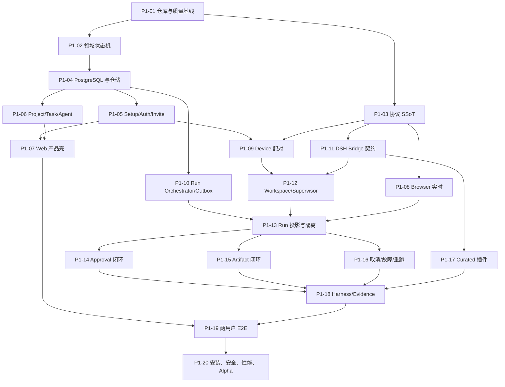

# 第一阶段里程碑与 Issue 拆分

> 本文把实施计划转换成可以独立领取、独立评审、独立验收的纵向 Issue。每个 Issue 原则上对应一个 squash PR；不得按“先把所有数据库做完、再把所有 UI 做完”的水平层拆分。

## 1. Epic

**Epic 标题**：`Phase 1: two-member, multi-agent Task-to-Artifact loop`

**Epic 完成条件**：

- G1–G7、R1–R9 全部通过。
- 两个独立浏览器用户完成 Builder→Approval→Artifact→Reviewer 闭环。
- 至少一个未修改 curated DSH 插件工作。
- Docker Compose 从空卷安装完成。
- 所有隐私、恢复、性能和 DSH 契约门全绿。

建议标签：

```text
type:feature
phase:1
area:domain | area:hub | area:web | area:node | area:runtime | area:security | area:test
priority:p0 | priority:p1
blocked | ready | needs-decision
```

Phase 1 的所有 Issue 都是 `priority:p0`；只有文案、视觉微调和非 Chromium 兼容可标记 `priority:p1`。

## 2. 依赖图



## 3. Issue 清单

| ID | 标题 | 主交付 | 依赖 | 主泳道 |
|---|---|---|---|---|
| P1-01 | 初始化开源 monorepo 与质量门 | 可重复构建、检查、发布的空仓库 | 无 | 全体 |
| P1-02 | 固化领域状态机与权限策略 | 纯 TypeScript domain module | P1-01 | Hub |
| P1-03 | 建立协议与 fixture 单一事实源 | HTTP/WS/Node/Runtime Zod schema | P1-01 | Runtime |
| P1-04 | 建立 PostgreSQL schema、事务仓储与 Outbox | 数据层可运行 | P1-02 | Hub |
| P1-05 | 完成首次 Setup、登录、邀请与角色 | 两账号可安全登录 | P1-04 | Hub |
| P1-06 | 完成 Project、Task、Comment、Agent Revision | 团队协作对象可用 | P1-04 | Hub |
| P1-07 | 建立 Web 产品壳与 Task Room | 两成员可完成接受任务 | P1-05/06 | Web |
| P1-08 | 建立 Browser Team Event 实时链路 | cursor 重连与权限投影 | P1-03/05 | Web |
| P1-09 | 完成 Device 配对、Token、heartbeat | Node 安全连入 Hub | P1-03/05 | Node |
| P1-10 | 完成 Run Orchestrator 与事务 Outbox | Run 可可靠派发到 Fake Device | P1-02/04 | Hub |
| P1-11 | 建立 DSH 版本锁、契约探针和 Runtime Bridge | 不改 DSH 即可驱动 Agent | P1-01/03 | Runtime |
| P1-12 | 完成 Workspace Registry 与 Runtime Supervisor | 真 Node 可启动隔离 Runtime | P1-09/11 | Node |
| P1-13 | 完成 DSH Event 投影、脱敏与双受众流 | Task Room 可安全观察 Run | P1-08/10/12 | 跨泳道 |
| P1-14 | 完成一次性 Approval 闭环 | owner 批准/拒绝/过期 | P1-13 | 跨泳道 |
| P1-15 | 完成 Artifact 候选、存储、发布与 Reviewer 输入 | 可交付并由第二 Agent 消费 | P1-13 | 跨泳道 |
| P1-16 | 完成取消、强杀、丢失与显式重跑 | 不做假恢复 | P1-13 | 跨泳道 |
| P1-17 | 完成 curated Plugin Pack 与未修改插件验证 | 生态假设被验证 | P1-11/12 | Runtime |
| P1-18 | 建立六原语 harness 与 Evidence 包 | 自动取证和可证伪判定 | P1-14/15/16/17 | Test |
| P1-19 | 完成两浏览器全链 E2E 与恢复场景 | 全部产品门自动化 | P1-07/18 | Test |
| P1-20 | Compose、安装文档、安全/性能 gate 与 Alpha 发布 | 可供首批团队试用 | P1-19 | 全体 |

## 4. 每个 Issue 的验收边界

### P1-01：初始化开源 monorepo 与质量门

交付：

- Node 24 + pnpm 11.7 monorepo。
- `apps/hub`、`apps/web`、`apps/node`、`apps/runtime` 与五个 packages 空壳。
- TypeScript project references、Vitest、oxlint、format、dependency boundary check。
- `LICENSE`、`NOTICE`、`SECURITY.md`、`CONTRIBUTING.md`、`CODE_OF_CONDUCT.md`。
- GitHub Actions：静态、单元、Linux 构建；任何 gate 失败阻止合并。

验收：干净 clone 后 `corepack enable && pnpm install --frozen-lockfile && pnpm check` 全绿。

### P1-02：固化领域状态机与权限策略

交付：

- Task/Assignment/Run/Approval/Artifact 状态机。
- `can(actor, action, resource)` 权限决策。
- 所有非法迁移使用稳定 ErrorCode。
- Builder/Reviewer 标准 fixture。

验收：状态迁移表的每条合法和非法边均有测试；权限矩阵逐格断言。

### P1-03：建立协议与 fixture 单一事实源

交付：

- Zod SSoT：HTTP DTO、Client Event、Node Wire、Runtime Wire。
- JSON Schema 生成、示例 fixture、版本与未知字段策略。
- `protocolVersion=1` 和跨包 import 规则。

验收：fixture 往返解析；生成物漂移使 `pnpm check` 失败；未知 command fail-closed。

### P1-04：PostgreSQL schema、事务仓储与 Outbox

交付：

- 第一阶段所有表、索引、check/unique/FK 约束。
- Drizzle migration 与 repository modules。
- 命令、领域状态、Team Event、Outbox 同事务提交。
- 临时 PostgreSQL 测试启动器。

验收：模拟 Hub 在 commit 后崩溃，Outbox worker 重启仍派发；重复事件不重复应用。

### P1-05：首次 Setup、登录、邀请与角色

交付：

- 一次性 Setup Token。
- Argon2id 密码、opaque Session Cookie、Origin gate。
- 邀请创建/接受、成员停用、最后 Owner 保护。
- 审计事件和速率限制。

验收：G1-01..06、HTTP/IDOR 安全用例全绿。

### P1-06：Project、Task、Comment、Agent Revision

交付：

- Project/Task/Comment CRUD 的限定接口。
- Assignment 接受、拒绝、重新指派。
- 责任人显式提交验收、完成或取消 Task；Run/Agent 不自动完成。
- Agent 与不可变 Profile Revision。
- Task Room 聚合查询，不暴露 runtime internals。

验收：G2-01..06 全绿；Run 尚未实现时通过 Fake Run summary fixture 展示聚合形态。

### P1-07：Web 产品壳与 Task Room

交付：

- Setup、登录、Project 列表、Task 列表/详情。
- Task Room：责任人、Assignment、Comment、Run 区、Artifact 区。
- Agent 管理、Device 状态入口。
- 错误、空态、断网与 session expiry 体验。

验收：Alice 创建 Task、Bob 在第二 BrowserContext 接受并评论；键盘可完成主链。

### P1-08：Browser Team Event 实时链路

交付：

- `/ws/v1/client` 认证、Origin、cursor 和 24 小时保留。
- TanStack Query 精确 invalidation。
- owner-only/project audience filter。
- `resync.required` 回退。

验收：G2-06、R2、R3 和 WS 攻击矩阵全绿。

### P1-09：Device 配对、Token 与 heartbeat

交付：

- `tabtin-node pair`、本地配置 mode 0600。
- Devices 页的配对码、倒计时与设备状态。
- Device Token hash 与撤销；需要新 Token 时重新配对，不做双 Token 旋转窗口。
- `/ws/v1/node` hello/heartbeat/lease。
- Node version/protocol/profile capabilities 上报。

验收：G3-01..03、R4/R5 的连接前半场全绿。

### P1-10：Run Orchestrator 与事务 Outbox

交付：

- `RunOrchestrator` 深模块。
- Run 创建、活跃唯一、idempotency、状态迁移。
- Outbox claim/ack/retry/失败。
- 内存 Device Gateway Adapter。

验收：G4-01..03、R7/R8 使用 Fake Device 全绿。

### P1-11：DSH 版本锁、契约探针和 Runtime Bridge

交付：

- `dsh.lock.json` 与 pnpm catalog。
- TabTin Cordis bundle、Runtime bin 与 NDJSON bridge。
- `ctx.agents` 驱动、Session event、cancel、approval answerer。
- `dsh-llm-replay` 无密钥 fixture。

验收：十项 DSH 契约探针全绿；stdout purity 测试全绿。

### P1-12：Workspace Registry 与 Runtime Supervisor

交付：

- Node 本地 SQLite registry/spool。
- `workspace add/list/remove` 与 realpath 规则。
- Node inventory 上报与 owner-scoped `/workspaces` 投影；凭据只上报 slot 可用状态。
- 每 Run 独立子进程、环境 scrub、stderr tail、超时回收。
- `RuntimeDriver` 的 DSH 与 Fake Adapter。

验收：G3-04..06、Runtime 退出无孤儿进程。

### P1-13：DSH Event 投影、脱敏与双受众流

交付：

- DSH SessionEvent→ProjectedRunEvent 的单一 projector。
- Task Room Run Launcher：选 Agent Revision、自己的 Workspace 和 credential slot。
- owner/project/admin 三种 audience。
- live delta 非持久通道。
- Node spool、Hub `(runId, seq)` 去重、Browser 投影。

验收：G4-04..06、R1/R6、secret corpus 全绿。

### P1-14：一次性 Approval 闭环

交付：

- DSH callId 关联与工具 preview。
- pending/allow/reject/expire/cancel 状态。
- owner-only 决策、并发 first-wins。
- Task Room Approval 卡与 project 等待态。

验收：G5-01..07 全绿。

### P1-15：Artifact 与 Reviewer 输入

交付：

- `publish_artifact` DSH 工具。
- Workspace realpath/size/hash 验证。
- 本地内容寻址 Artifact Store。
- candidate/publish/download 权限。
- Reviewer Run 的只读 Artifact input manifest。

验收：G6-01..08、路径攻击矩阵全绿。

### P1-16：取消、故障与显式重跑

交付：

- cancel/forced kill/runtime lost/device lease 行为。
- `rerunOfRunId` 和 UI 血缘。
- 未知副作用警示，不自动重启。
- Hub/Node/Runtime 的清晰 failure code。

验收：G7-01..06、R4/R5/R9 全绿。

### P1-17：Curated Plugin Pack

交付：

- 精确 package/version/integrity 与完整依赖闭包 lock digest 安装。
- capability manifest、legacy_unrestricted 分类。
- immutable pack digest 与 Node preflight。
- 一个未修改 fixture DSH 插件。
- Admin Plugin Settings 展示审核信息，组装不可变 Pack，不自动修改已有 Revision。

验收：插件攻击矩阵与 Profile digest 契约全绿；插件崩溃不影响 Hub。

### P1-18：Harness 与 Evidence

交付：

- 每个主链的 drive/observe/assert/localize/evidence/discover。
- `scripts/phase1-drive.mts` 和 `scripts/phase1-verify.mts` 分离。
- 跨层 traceId/runId 索引。
- Evidence 包与 secret scan。

验收：故意打断任一层，verify 必须 FAIL 并指明 Hub、Node、Runtime 或 Browser。

### P1-19：两用户全链 E2E

交付：

- Alice/Bob 两 BrowserContext。
- Builder→Approval→Artifact→Reviewer 标准场景。
- allow、reject、cancel、retry、Hub restart、Node reconnect 场景。
- 连续 20 次运行器和失败证据保留。

验收：G1–G7、R1–R9 全绿且无 flaky retry 才算通过。

### P1-20：安装、安全、性能与 Alpha 发布

交付：

- Hub/Web 镜像、PostgreSQL Compose、持久卷、healthcheck。
- Linux Hub 与 macOS/Linux Node 安装文档。
- 安全、性能、依赖许可与 SBOM gate。
- `v0.1.0-alpha.1` release notes 和升级/回滚说明。

验收：空卷安装、Q0–Q9 全绿，三名非开发试用者按文档完成闭环。

## 5. 六周参考节奏

### 第 1 周：基础与团队对象

- Hub：P1-01、P1-02、P1-04。
- Runtime：P1-03，并开始 P1-11 契约探针。
- Web：基于协议 fixture 建立 P1-07 的静态路由骨架。
- 周门：Q0/Q1/Q2；数据库、状态机和协议不可再随意改名。

### 第 2 周：两名成员协作

- Hub：P1-05、P1-06。
- Web：完成 P1-07。
- Runtime：完成 P1-11。
- 周门：Alice/Bob 完成 Setup→Invite→Task→Accept，不依赖 Runtime。

### 第 3 周：真实执行骨架

- Hub：P1-10。
- Node：P1-09、P1-12。
- Web：P1-08。
- 周门：Fake Runtime 与 DSH Replay Runtime 都能完成一个 Run。

### 第 4 周：多人可见但不越权

- 跨泳道：P1-13、P1-14、P1-16。
- 周门：审批、取消、断线和双受众 frame diff 全绿。

### 第 5 周：交付与生态

- 跨泳道：P1-15、P1-17、P1-18。
- 周门：Builder Artifact 被 Reviewer 消费；未修改插件工作；证据包可自动生成。

### 第 6 周：开源 Alpha

- Test：P1-19。
- 全体：P1-20。
- 周门：Q0–Q9 全绿，完成 `v0.1.0-alpha.1`。

## 6. 分支与评审策略

新仓库不沿用 TabTin 1.x 的 release 分支体系。第一阶段采用：

- 受保护 `main`。
- 短生命周期分支：`feat/p1-<issue>-<slug>`、`fix/p1-<issue>-<slug>`。
- 一个 Issue 一个 squash PR；PR 标题带 `P1-XX`。
- 必需本地与 CI gate 按受影响范围运行，P1-19/20 必须跑全量。
- DSH 版本升级永远单独 PR，不能夹在功能 PR 中。
- 协议、migration、DSH Adapter 与安全策略至少两人 review。
- PR 不允许以“后续补测试”合入；测试属于同一 Issue 的交付物。

## 7. 变更控制

第一阶段执行中只有以下情况允许修改本方案的承重决定：

1. DSH 公开 interface 无法支持且官方代码证明不存在等价 seam。
2. 两用户真实试用证明 Task→Run→Artifact 心智错误。
3. 安全验证证明进程隔离仍无法满足最小权限。
4. 性能数据证明单 Hub/PostgreSQL 无法承载目标负载。

发生时先新增或 supersede ADR，再修改领域协议和对应 Issue；不得在某个实现 PR 里静默改变模型。
